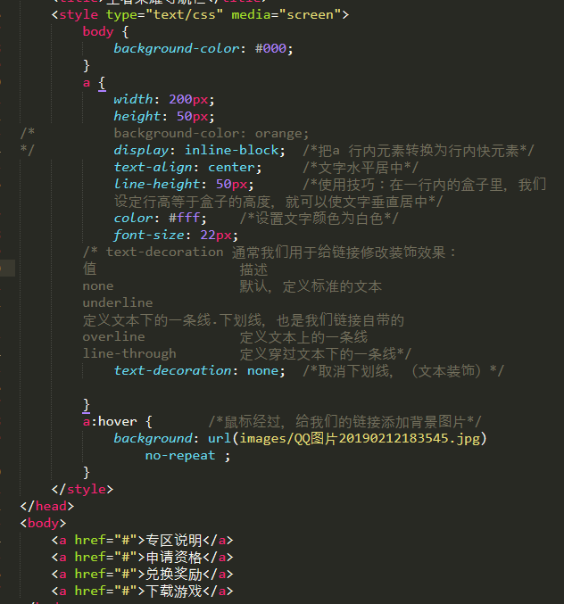
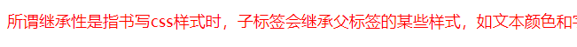

# ​命名规范

   	头:header
	内容:content/container
	尾:footer
	导航:nav 
	侧栏:sidebar
	栏目:column
	页面外围控制整体布局宽度:wrapper
	左右中:left right center 
	登陆条:loginbar
	标志:logo
	广告：banner
	页面主体:main
	热点：hot
	新闻：news
	下载：download
	子导航：subnav
	菜单：menu
	子菜单:submenu
	搜索：search
	友情链接：friendlink
	页脚:footer 
	版权:copyright
	滚动：scroll
	内容:content 
	标签页：tab
	文章列表:list
	提示信息：msg
	小技巧：tips
	栏目标题：title

# 快捷键

Ctrl+Shift+P：打开命令面板
Ctrl+P：搜索项目中的文件
Ctrl+G：跳转到第几行
Ctrl+W：关闭当前打开文件
Ctrl+Shift+W：关闭所有打开文件
Ctrl+Shift+V：粘贴并格式化
Ctrl+D：选择单词，重复可增加选择下一个相同的单词
Ctrl+L：选择行，重复可依次增加选择下一行
Ctrl+Shift+L：选择多行
Ctrl+Shift+Enter：在当前行前插入新行
Ctrl+X：删除当前行
Ctrl+M：跳转到对应括号
Ctrl+U：软撤销，撤销光标位置
Ctrl+J：选择标签内容
Ctrl+F：查找内容
Ctrl+Shift+F：查找并替换
Ctrl+H：替换
Ctrl+R：前往 method
Ctrl+N：新建窗口
Ctrl+K+B：开关侧栏
Ctrl+Shift+M：选中当前括号内容，重复可选着括号本身
Ctrl+F2：设置/删除标记
Ctrl+/：注释当前行
Ctrl+Shift+/：当前位置插入注释
Ctrl+Alt+/：块注释，并Focus到首行，写注释说明用的
Ctrl+Shift+A：选择当前标签前后，修改标签用的
F11：全屏
Shift+F11：全屏免打扰模式，只编辑当前文件
Alt+F3：选择所有相同的词
Alt+.：闭合标签
Alt+Shift+数字：分屏显示
Alt+数字：切换打开第N个文件
Shift+右键拖动：光标多不，用来更改或插入列内容
Ctrl+依次左键点击或选取，可需要编辑的多个位置
Ctrl+Shift+上下键：替换行

# css书写规范

```

	1.空格规范 
	【强制】 选择器与 { 之间必须包含空格。
	示例：	.selector {}
	【强制】 属性名与之后的：之间不允许包含空格，
		  ：与属性值之间必须包含空格。
	示例：	font-size: 12px;
	2.选择器规范 
	【强制】 当一个rule包含多个selector时，每个选择器声明必须独占一行。
	示例：	div,
			p,
			span,
			b {
			color:red;
		}
	3.【建议】选择器的嵌套层级应不大于3级，位置靠后的限定条件应尽可能精确。
	示例：	.nav>ul>li>a 
			<div class="nav">
				<ul>
					<li><a href=""></a></li>
				</ul>
			</div>
			css样式：
			.nav li a {
			color: red;
		}
	4.属性规范 
	【强制】属性定义必须另起一行。属性定义后必须以分号结尾。
	示例：	a {
			width: 50px;
			height: 20px;
			background-color: deeppink;
			display: inline-block;	
			}
```


# 字体样式字号和字体

font综合设置字体样式：顺序一致，可以省略前两个，但必须要有后两个字号和字体。
选择器{font:font-style font-weight font-size/line-height font-family;}

例如：font:italic bold 14px "微软雅黑";

## 字体倾斜：

```
font-style: italic; 

<em></em>   <!-- 让字体倾斜 -->

em{
			font-style: normal;    /*让斜体不倾斜*/
		}
```


## 字体加粗：

```
font-weight:700;   

normal(400),bold(700),bolder,lighter,100-900

<strong></strong><!-- 让字体加粗 -->

strong{
		font-weight:normal; /*让粗体变得不加粗*/
		}
```


# css基本选择器

## 目标伪类选择器

<style>
		:target {	/*目标伪类选择器，选择器可用于选取当前活动的目标元素。*/
			color:red;
			font-size:30px;
		};
</style>


## 类选择器和id选择器

```css
/*类选择器*/
	.c-orange {
		color:orange;		/*声明类样式*/
	}
	.c-blue {
		color:blue;
	}
	.c-red{		/*见名知意*/
		color:red;
	}
	</style> 
</head>
<body>
<div class="c-orange">鸣人</div>	
<div class="c-blue">佐助</div>
<div class="c-red">小樱</div>
```


```css
/*id选择器*/
	#purple {
		color:purple;
	}
		</style> 
</head>
<body>
---------------id选择器-------
	<div id="purple">雏菊</div>
	<div>佐佐木</div>
```


```css
/*		类选择器和id选择器的区别
*/	.green {
			color:green;
		}
		#pink {
			color:pink;
		}
		---------- 类选择器和id选择器的区别----------
	类选择器是可以重复多次使用的，类似于人名 张三
 

 	<div class="green">张三</div>
 	<div id="pink">张三丰</div>
 	<div class="green">张三疯子</div>

```


id选择器是唯一的，只能调用一次不得重复使用，好比人的身份证号码


	总结：类选择器和id选择器的区别就是在使用次数上。

## 多类名选择器

```CSS
.font20{
			font-size: 20px;
		}
		.font14{
			font-size:14px;
		}
		.pink {
			color:pink;
		}
		.fontweight {
			font-weight:bold;
		}
	</style>
</head>
<body>
<!-- 样式显示效果跟html中的类名先后顺序没有关系，受css样式书写的上下顺序有关，各个类名中间用空格隔开 -->
	<div class="font20 pink fontweight">张飞</div>   
	<div class="font20">刘备</div>
	<div class="font14 pink">关羽</div>
	<div>诸葛亮</div> 
	
	<div class="pink font14 fontweight">张飞</div>   
	<div class="fontweight font20 pink">刘备</div>
	<div class="font14 pink">关羽</div>
	<div>诸葛亮</div>
```


## 通配符选择器

一般用于测试，实际开发中基本不用。通配符选择器用“*”号表示，他是所有选择器中使用范围最广的，能匹配页面中所有的元素。**指所有的标签。

```css
	}*/
		* {		/*    “*指所有的标签”      */
			color:purple;
		}
	</style>
	
</head>
<body>
	一般用于测试，实际开发中基本不用
 
 	<h1>通配符选择器用“*”号表示，他是所有选择器中使用范围最广的，能匹配页面中所有的元素。</h1>
	<h1>通配符选择器用“*”号表示，他是所有选择器中使用范围最广的，能匹配页面中所有的元素。</h1>
	<p>	通配符选择器用“*”号表示，他是所有选择器中使用范围最广的，能匹配页面中所有的元素。</p>
	<p>	通配符选择器用“*”号表示，他是所有选择器中使用范围最广的，能匹配页面中所有的元素。</p>
	<ul>
		<li>通配符选择器用“*”号表示，他是所有选择器中使用范围最广的，能匹配页面中所有的元素。</li>
		<li>通配符选择器用“*”号表示，他是所有选择器中使用范围最广的，能匹配页面中所有的元素。</li>
	</ul>
```


## 链接伪类选择器

​	伪类选择器也是一个选择器，用于向某些选择器添加特殊的效果，比如给链接添加特殊的效果，比如可以选择第一个，第n个元素。类选择器是一个点，伪类选择器是两个点。

```css
链接伪类选择器：  <!-- 主要针对于a -->
    :link  <!-- 未访问的链接 -->
    ：visited  <!-- 已访问的链接 -->
    ：hover  <!-- 鼠标移动到链接上 -->
    ：active  <!-- 选定的链接 -->
```


## 结构伪类选择器

```
结构(位置)伪类选择器：
	：first-child:选取属于其父元素的首个子元素的指定选择器
	：last-child:选取属于其父元素的最后一个子元素的指定选择器
	：nth-child(n):匹配属于其父元素的N个子元素,不论元素的类型 even偶数 odd奇数 n从0开始
	：ntn-last-child(n):选择器匹配属于其元素的第N个子元素的每个元素，不论元素的类型，从最后一个子元素开始计数。n可以是数字，关键字或公式
```


结构伪类选择器针对于兄弟关系。

### google练习

```css
<style>     
	span {
		font-size: 100px;
	}
	.blue {
		color:blue;
	}
	.red {
		color:red;
	}
	.orange {
		color:orange;
	}
	.green {
		color:green;
	}
	</style>
</head>
<body>
	<span class="blue">G</span>
	<span class="red">o</span>
	<span class="orange">o</span>
	<span class="blue">g</span>
	<span class="green">l</span>	
	<span class="red">e</span>

```


# css外观样式及应用

## css颜色

color属性用于定义文本的颜色，其取值方式有如下3种：

- 预定义的颜色值，如red,green,blue等。

- ※十六进制，如#FF0000,#FF6600,#29D794等，十六进制是最常用的定义颜色的方式。

- RGB代码，如红色可以表示rgb(255,0,0)或rgb(100%,0%，0%）。

```css
	/*css颜色*/
		.red{
			color:red;
		}
		li:nth-child(2){
			color:#FF6600;	
				/*FF6600可以简写成f60  以后颜色尽量是十六进制，提倡简写*/
		}
		#rgb {
			color:rgb(53,50,205)
		}
		-----------------------------------
				<!-- css颜色 -->
	<h3>color属性用于定义文本的颜色，其取值方式有如下3种：</h3>
	<ol>
		<li class="red">预定义的颜色值，如red,green,blue等。</li>
		<li>※十六进制，如#FF0000,#FF6600,#29D794等，十六进制是最常用的定义颜色的方式。</li>
		<li id="rgb">RGB代码，如红色可以表示rgb(255,0,0)或rgb(100%,0%，0%）。</li>
	</ol>
```


## 行高对其首行缩进

```css
/*行高对其首行缩进*/
		p {
			line-height:25px;	
			/*行间距，一般情况下，行距比字号大7，8像素就可以了*/
			text-indent: 2em;	
			/*首行缩进，1em就是一个字的宽度，如果是汉字的段落，1em就是一个汉字的段落*/
		}
		h2 {
			text-align:center;	/*文字水平对齐*/	
		}
		------------------------------------
<!-- 行高对其首行缩进 -->
		<h2>海贼王的创作背景</h2>
	<p>《航海王》是日本漫画家尾田荣一郎作画的少年漫画作品，在《周刊少年Jump》1997年34号开始连载。改编的电视动画《航海王》于1999年10月20日起在富士电视台首播。
	2012年5月11日，《航海王》获得第41回日本漫画家协会赏 。截至2015年6月15日，《航海王》以日本本土累计发行了3亿2086万6000本，被吉尼斯世界纪录官方认证为“世界上发行量最高的单一作者创作的系列漫画”。2017年7月21日，日本纪念日协会通过认证，将每年的7月22日设立为“ONE PIECE纪念日”。</p>
	<p>创作海贼故事是
```


## 字间距和单词间距和颜色半透明和文字阴影

```css
<style type="text/css" media="screen">
		div {
			letter-spacing: 2px;   /*字间距*/
		}
		p {
			word-spacing:5px; 	/*单词间距，主要针对于英文，中文无效*/
		}
		h1 {
			color:rgba(255,0,0,0.2);
			/*颜色半透明，color；rgba(r,g,b,a) a是alpha 透明的意思 取值范围0-1之间  o是完全透明，1是完全不透明 */
		}
		h2 {
			font-size: 100px;
			text-shadow: 7px 8px 3px rgba(0,0,0,0.5);
		/*文字阴影text-shadow:水平位置 垂直位置 模糊距离 阴影颜色,水平和垂直位置 前两个参数必须写，后面的两个参数可以省略 使用默认值*/		}
	</style>
</head>
<body>
	<div>我是熊大</div>
	<p>my name is sara</p>
	<h1>文字是可以半透明的</h1>
	<h2>你是阴影，我是火影</h2>
	
```


### 文字阴影:

text-shadow:水平位置 垂直位置 模糊距离 阴影颜色
	

| 值       | 描述                             |
| -------- | -------------------------------- |
| h-shadow | 必需。水平阴影的位置，允许负值。 |
| v-shadow | 必需。垂直阴影的位置，允许负值。 |
| blur     | 可选。模糊的距离。               |
| color    | 可选，阴影的颜色，​               |

### 字间距:

letter-spacing: 2px;   

### 单词间距:

word-spacing:5px; 	主要针对于英文，中文无效

### 颜色半透明:

color；rgba(r,g,b,a)   a是alpha 透明的意思 取值范围0-1之间  o是完全透明，1是完全不透明.

### 案例：

```css
body {
		color:#3c3c3c;	/*一般网页不用纯黑，用淡灰色 3c3c3c*/
		font-size: 16px;
		}
		h1 {
		text-align: center;		/*文字水平居中*/
		font-size:25px;
		font-weight: normal;   /*让粗体不加粗*/
	 	 }
	 	 div {
	 	 	text-align: center;
	 	 	font-size: 14px;
	 	 }
	 	 .entertainment {
	 	 	color:#00f;
	 	 }
	 	 .partcipate {
	 	 	color:#ccc;
	 	 }
	 	 .elect {
			color:green;
	 	 }
	 	 .elect:hover{	/*链接伪类选择器*/
	 	 	color:#f00;
	 	 }
	 	 p{
	 	 	font-size: 14px; 
			line-height: 22px;	 	
		 	text-indent: 2em;		/*首行缩进两个字符*/
		 	letter-spacing: 1px;	/*设置字间距*/

	 	 }
	 	 em {
	 	 	font-style: normal;		/*让斜体不倾斜*/
	 	 	color: skyblue;
	 	 }

	 	 :target {	/*目标伪类选择器，选择器可用于选取当前活动的目标元素。*/
			color:red;
			font-size:30px;
	</style>
```


# 标签显示模式

## 行内样式表

行内样式表（内联式）是通过标签的style属性来设置元素的样式,我们修改一小点样式的时候，可与通过内联样式表快速完成，直接在标签内部写样式。
	语法格式：<标签名 style=“属性1：属性值1；属性2：属性值2；属性3：属性值3”>内容</标签名>

```css
<div  style="color: #f00"></div>
<div style="color: #00f; font-size: 12px;"></div>
```

## 内部样式表

内部样式表（内嵌式）是将css代码集中写在html文档的head头部标签中，并用style标签定义

```css
<style type="text/css" media="screen">
		div {
			color:pink;  
		}

	</style>
```

## 外部样式表

链入式是将所有的样式放在一个或多个以css为扩展名的外部样式表文件中，通过link标签将外部样式表文件链接到HTML文档中。
		语法格式：
	

```
	<!-- <head>
			<link href="css文件的路径" type="text/css" rel="stylesheet">
		<	/head> -->
```

​		link标签就是把外面的css引入到当前的HTML页面中。 就是css和html文件的桥梁   做连接。


!1550814165947](asset/1550814165947.png)


## 3种样式表总结:

| 样式表     | 优点                   | 缺点                   | 使用情况       | 控制范围         |
| ---------- | ---------------------- | ---------------------- | -------------- | ---------------- |
| 行内样式表 | 书写方便，权重高       | 没有实现样式和结构分离 | 较少           | 控制一个标签(少) |
| 内嵌样式表 | 部分结构和样式分离     | 没有彻底分离           | 较多           | 控制一个页面(多) |
| 外部样式表 | 完全实现样式和节后分离 | 需要导入               | 最多，强烈推荐 | 控制整个站点(多) |

## 块级元素

每个块级元素通常都会独自占据一整行或多整行，可以对其设置宽度，高度，对齐等属性，通常用于网页布局和网页结构的搭建。通常的块级元素有：
	

```
<h1>---<h6>,<p>,<div>,<ul>,<ol>,<li>等，其中<div>标签是最典型的块元素
```

块级元素(block-level)特点：
	1.总是从新行开始
	2.宽度，行高，外边距以及内边距都可以控制
	3.宽度默认是容器的100%
	4.可以容纳内联元素和其他块级元素


## 行内元素

行内元素（内联元素）不占有独立的区域，仅仅靠自身的字体大小和图像尺寸来支撑结构，一般不可以设置宽度，高度，对齐等属性，常用于控制页面中文本的样式。常见的行内元素有：

```
<a>,<strong>,,<b>,<em>,<i>,<del><s>,<ins>,<u>,<span>等，其中<<span>标签是最典型的行呢元素。
```

行内元素的特点：
		1.和相等行内元素在一行上。
		2.高，宽无效，但水平方向的padding和margin可以设置，垂直方向的无效。
		3.默认宽度就是它本身内容的宽度。
		4.行内元素只能容纳文本或其他行内元素。（a特殊）
	 ps:只有文字才能组成段落，因此p里面不能放块级元素，同理还有这些标签h1,h2,h3,h4,h5,h6,dt,他们都是文字类块级标签，里面不能放其他块级元素。链接里面不能再放链接。


## 行内块元素

在行内元素中有几个特殊的标签,<input />,<td>，可以对他们设置宽高和对齐属性，有些资料可能会称他们为行内块元素。既具有行内元素的特点又有块级元素的特点。
	 行内块（inline-block)的特点：
	 1.和相邻行内元素(行内块)在一行上，但是之间会有空白缝隙。
	 2.默认宽度就是它本身内容的宽度。
	 3.宽度，行高，外边距以及内边距都可以控制。


```css
标签显示模式转换display：
 	块转行内：display：inline；
 	行内转块：display：block;
 	块，行内元素转换为行内块：display：inline-block;
```


# css复合选择器

## 交集选择器

交集选择器由两个选择器构成，其中第一个为标签选择器，第二个为class选择器，两个选择器之间不能有空格，如h3.special。

```css
h3.class {color:red; font-size: 25px;}
```

记忆技巧：交集选择器是既又，并且的意思。

比如：	p.one选择的是类名为one的段落标签。

```css
要求：既是歌手又是港澳台的加粗
	<div class="singer">刘德华</div>
	<div class="singer">张学友</div>
	<p class="singer">汪峰</p>
	<p class="singer">韩红</p>
	----------------------------------------------
		.singer {
			color:#f00;
		}
		div.singer {
			font-weight:700;
		}
```

## 并集选择器

并集选择器（css选择器分组）是各个选择器通过逗号连接而成的，任何形式的选择器（包括标签选择器，class类选择器id选择器等），都可以作为并集选择器的一部分，如果某些选择器定义的样式完全相同，或部分相同，就可以利用并集选择器为他们定义相同的css样式。

```
	.class,h3{color:red; font-size25px;}
```

记忆技巧：并集选择器 和的意思，就是说，只要逗号隔开的，所有选择器都会执行后面样式。

 比如： .one,p,#test {color:#f00}表示.one和P和#test这三个选择器都会执行颜色为红色，通常用于集体申明。	

​行颜色为红色，通常用于集体申明。

```css
	 要求都变成红色
	<p>香蕉</p>
	<p>橘子</p>
	<div>大白菜</div>
	<div>辣椒</div>
	<div>青菜</div>
	<h1>米饭</h1>
	<h1>馒头</h1>
	<em class="yao">我也要变色</em>	
```

​	

## 后代选择器

后代选择器：又称为包含选择器，用来选择元素或元素组的后代，其写法就是把外层标签写在前面，内层标签写在后面,中间用空格分隔。当标签发生嵌套时，内层标签就成为外层标签的后代。	

```css
.class h3 {color: red; font-size: 25px;}
```

子代后代都可以这么选择，或者说，他能选择任何包含在内的标签。

```css
	要求：首页导航联系为红色
	<div class="nav">
		<ul>
			<li>首页</li>
			<li>导航</li>
			<li>联系</li>
		</ul>
	</div>
	<div>
		<ul>
		<li>百度</li>
		<li>新浪</li>
		<li>谷歌</li>
	</ul>
	</div>
	-------------------------------------------------------------
	.nav ul li {
			color:#f00;
		}
		---------后代选择器----------------
```

## 子元素选择器

子元素选择器：只能选择作为某元素子元素的元素，其写法就是把父级标签写在前面，子集标签写在后面，中间跟一个>进行连接，注意，符号左右两侧各保留一个空格。

```
.class>h3 {color:red; font-size:25px;}
```

子元素选择器 这里的子 指的是亲儿子不包含孙子 重孙子之类。
	比如：demo>h3{color:red}说明h3一定是demo亲儿子。demo元素包含着h3。

```css
要求一级菜单变为红色
	<ul class="item">
		<li>一级菜单
			<ul>
				<li>二级菜单</li>
				<li>二级菜单</li>
			</ul>
		</li>
		<li>一级菜单
			<ul>
				<li>二级菜单</li>
				<li>二级菜单</li>
			</ul>
		</li>
		<li>一级菜单
			<ul>
				<li>二级菜单</li>
				<li>二级菜单</li>
			</ul>
		</li>
	</ul>
----------------------------------------------------------------
.item li {
			color:#f00;		/*后代选择器*/
		}
.item > li {		/*子元素选择器*/
			color:#00f;
		}
```


## 测试选择器


## 属性选择器

| **选择器         | **含义                              |
| ---------------- | ----------------------------------- |
| E[attr]****      | 存在attr属性即可                    |
| E[attr=val]****  | 属性值完全等于val                   |
| E[attr*=val]**** | 属性值里包含val字符并且”任意“位置   |
| E[attr^=val]**** | 属性值里包含val字符并且在“开始”位置 |
| E[attr$=val]**** | 属性值里包含val字符并且在“结束”位置 |


## 伪元素选择器

```css
::first-child-letter  文本的第一个单词（如中文，日文，韩文等）
::first-line		文本第一行
::selection   		可改变选中文本的样式
```

```css
<title>伪元素选择器</title>
	<style type="text/css" media="screen">
		/*.demo 伪类选择器
		：first-child 伪类选择器
		::fiest-letter 伪元素选择器*/
		p::first-letter {	/*选择第一个字*/
			color: red;
			font-size: 50px;
		}  
		p::first-line {	/*选择第一行*/
			color: green;
		}
		p::selection {	
		/*当我们选中文字的时候，可以变化的样式，平常选中的时候都是蓝底白字，可以自己设置*/
			color: pink;
		}
		div::before {	/*before和after 在盒子div 的内部前面插入或者内部后面插入*/
			content: "俺";	
		}div::after {
			content: "18";	
		}
	</style>
</head>
<body>
	<h1>你有freestyle吗</h1>
	<p>吴亦凡（Kris），1990年11月6日出生于广东省广州市，华语影视男演员、流行乐歌手。
2007年，吴亦凡加入了韩国SM娱乐公司。2012年作为EXO组合成员正式出道，担任EXO/EXO-M队长、主Rapper、门面。
2014年5月15日，吴亦凡正式向首尔中央地方法院请求判决与SM娱乐公司专属合同无效。之后吴亦凡回归中国发展，出演个人首部电影，担任徐静蕾执导的电影《有一个地方只有我们知道》男主角，凭此获得第3届伦敦国际华语电影节最佳新锐男演员奖。
2015年7月，登上杂志《Vogue》。同年发行首张原创制作单曲《Bad Girl》  。年底主演电影《老炮儿》上映，因饰演小爷谭小飞一角进一步受到广泛关注 。</p>
	<div>今年</div>

```


# css背景及应用

## 背景颜色图片及其平铺

### 背景颜色图片

```
background-color: #000;
background-image: url(images/米奇.jpg);
```

### 平铺

```
background-repeat: no-repeat;
repeat-x:背景图像在横向上平铺，repeat-y:背景图像在纵向上平铺，
repeat：背景图像在横向和纵向平铺，no-repeat:背景图像不平铺;
```

## 背景位置

```
background-position: left top;	默认的是左上角*/
			/*background-position: right bottom;*/
			/*background-position: center center;	 水平居中*/
			/*background-position: bottom;  */ 
			/*如果方位名词只写一个,另外一个默认为center
方位名词没有顺序,谁在前面都可以*/
			/*1.利用方位名词 top  bottom 来更改背景图片位置:
			top bottom left center right*/
			/*background-position: 10px 30px;	*/
			/*2.精确单位 第一个值一定是x坐标(横着),第二个一定是y坐标(竖着)*/
			/*3.混搭*/
			background-position: 10px center;
			/*10px center 水平10px 垂直是 居中*/
			/*center 10px 水平居中的 垂直是 10px*/
```

## 背景图片和背景简写

`background: 背景颜色 背景图片地址 背景平铺 背景滚动 背景位置(背景位置center 100px这个位置不能变，其他可变)`

```css
background-color: #000;  
		background-image: url(images/QQ图片20190212183545.jpg);
		background-repeat: no-repeat;
		background-attachment: fixed;	背景图片固定的
		background-position: center 80px;	水平居中 垂直 80px

background: 背景颜色 背景图片地址 背景平铺 背景滚动 背景位置(center 100px这个位置不能变，其他可变)

background: #000 url(images/QQ图片20190212183545.jpg) no-repeat fixed center 100px;
		写法和以上5句是等价的
```

## 背景半透明

css3支持背景半透明的写法语法格式是：

```css
background: rgba(0,0,0,0.3);
```

最后一个是alpha 透明度 取值范围 0-1之间

注意，背景半透明是指盒子背景半透明，盒子里面的内容不受影响。

同样，可以给文字和边框透明  都是rgba的格式来写。

## 背景缩放

通过background-size设置背景图片的尺寸，就像设置img的尺寸一样，

背景图片设置大小 background-size 可以是精确值也可以是百分比， 

（我们插入的图片 img 直接通过 width height 设置就可以）

- 可以设置长度单位（px)或百分比（设置百分比时，参照盒子的宽高）

- 设置为cover时，会自动调整缩放比例，保证图片始终填充满背景区域，如有溢出部分则会被隐藏。 图片进行等比例缩放，图片一定要保证宽度和高度同时满足盒子大小，势必会有部分超出去，超出部分就看不见了。【平时用cover最多】

- 设置为contain会自动调整缩放比例，保证图片始终完整显示再背景区域。图片进行等比例缩放，如果图片的高度或者宽度，有一个和盒子一样大了，就不再缩放，这样的好处就	是保证了图片的完整。不会有缺失的部分，但是会有部分裸漏。

  ``background-size: 100px;		我们尽量只改一个值，防止缩放失真扭曲
   background-size: 50%;	把背景图片缩放为原来的一半大``

  ## 多背景

  以逗号分隔可以设置多背景，可用于自适应布局。

  ```
  background-image: url((images/米奇.jpg),url(images/moshou1.jpg) ;
  ```

  多背景：以逗号分隔可以设置多背景，可用于自适应布局。
  	1.一个元素可以设置多重背景图像。
  	2.每组属性间使用逗号分隔。
  	3.如果设置的多重背景之间存在交集（即存在着重叠关系），前面的背景图片会覆盖在后面的背景图之上。
  	4.为了避免背景色将图像盖住，背景色通常都定义在最后一组上。


## 凹凸文字效果

```css
<style type="text/css" media="screen">
	body {
		background-color: #ccc;
		}
	div {
		font: 700 80px "微软雅黑";
		color: #ccc;
		}
		div:first-child {
			text-shadow: 1px 1px 1px #000,-1px -1px 1px #fff;
		}
		div:nth-child(2) {
			text-shadow: -1px -1px 1px #000,1px 1px 1px #fff;
		}
	</style>
	
</head>
<body>
	<div>我是凸起的文字</div>
	<div>我是凹下的文字</div>
ps:先让背景和文字都变成灰色，再用阴影的效果，左移下移模糊的距离再颜色
```


文字阴影：text-shadow:水平位置 垂直位置 模糊距离 阴影颜色, 

（水平和垂直位置 前两个参数必须写，后面的两个参数可以省略 使用默认值,）

| 值       | 描述                             |
| -------- | -------------------------------- |
| h-shadow | 必需。水平阴影的位置，允许负值。 |
| v-shadow | 必需。垂直阴影的位置，允许负值。 |
| blur     | 可选。模糊的距离。               |
| color    | 可选，阴影的颜色.                |

## 导航栏练习




# css3大特性

## css层叠性

所谓层叠性是指多种css样式叠加。

比如先给某个标签指定了内部文字颜色为红色，接着又指定了颜色为蓝色，此时出现一个标签指定了相同样式不同值的情况，这就是样式冲突。

一般情况下，如果出现样式冲突，则会按照css书写的顺序，冲突了，执行后面的，后面的层叠了前面的，层叠性，以最后的为准。

## 继承性

所谓继承性是指书写css样式时，子标签会继承父标签的某些样式，如文本颜色和字号,字号，行距(跟文字有关系）。但是并不是所有的css属性都可以继承，边框，外边距，内边距，背景，定位，元素高属性（块级元素）。




## css优先级

定义css样式时，会出现两个或更多规则应用在同一元素上，这时就会出现优先级的问题。

```
继承样式的权重为0，即再嵌套结构中，不管父元素验尸官hi的权重多大，被子元素继承时，他的权重都为0，也就是说子元素定义的样式会覆盖继承来的样式。
行内样式优先，应用style属性的元素，其行内样式的权重非常高，可以理解为远大于100，总之，它拥有比上面提高的选择器都大的优先级。
权重相同时，css遵循就近原则，也就是说靠近元素的样式具有最大的优先级，或者说排在最后的样式优先级最大。
css定义了一个！important命令，该命令被赋予最大的优先级，也就是说不管权重如何以及样式位置的远近，！important都具有最大优先级。
```

### css特殊性

关于css权重，我们需要一套计算公式去计算，这个就是css specificity,我们称为css特殊性或非凡性，他是一个衡量css值优先级的一个标准。

specificity用一个四位的数字串来表示，值从左到右，左面的最大，一级大于一级，数位之间没有进制，级别之间不可超越。

| 继承或者*的贡献值        | 0，0，0，0， |
| ------------------------ | ------------ |
| 每个元素（标签）贡献值为 | 0，0，0，1   |
| 每个类,伪类贡献值为      | 0，0，1，0   |
| 每个ID贡献值为           | 0，1，0，0   |
| 每个行内样式贡献值       | 1，0，0，0   |
| 每个!important贡献值     | 无穷大       |

!important就是重要的，级别最高，一旦出现优先执行。


## 权重叠加

| div ul li  | 0,0,0,3 |
| ---------- | ------- |
| .nav ul li | 0,0,1,2 |
| a:hover    | 0,0,1,1 |
| .nav a     | 0,0,1,1 |
| #nav p     | 0,1,0,1 |

数位之间没有进制，0，0，0，5+0，0，0，5=0，0，0，10而不是0，0，1，0，
继承的权重为0


## 优先级总结

优先级就是为了权重问题.总结优先级：
	1.使用了！important声明的规则。
	2.内嵌在HTML元素的style属性里面的声明。
	3.使用了ID选择器的规则。
	4.使用了类选择器，属性选择器，伪元素和伪类选择器的规则。
	5.使用了元素选择器的规则。
	6.只包含一个通用选择器的规则。
	7.同一类选择器则遵循就近原则。
	总结：权重是优先级的算法，层叠是优先级的表现。·

# css盒子模型及应用

css就是三个大模块，盒子模型，浮动，定位，其余的都是细节，要求这三部分，无论如何都要学好。

所谓 盒子模型，就是把HTML页面中的元素看作是一个矩形的盒子，也就是一个盛装内容的容器，每个矩形都由元素的内容，内边距，（padding），边框（border),和外边距（margin)组成。
	网页布局的本质，把网页元素比如文字图片等等，放入盒子里面，然后利用css摆放盒子的过程，就是网页布局。


## 盒子边框（border）

语法：

```css
border：border-width ||border-style || border-color
边框粗细，边框样式，边框颜色
```

边框属性——设置边框样式（border-style）

边框样式用于定义页面中边框的风格，常用属性值如下：

```
none:没有边框即忽略所有边框的宽度（默认值）
solid:边框为单实线（最为常用的）
dashed：边框为虚线
dotted：边框为点线
double：边框为双实线
```

### 盒子边框写法总结表

| 设置内容     | 样式属性                                                     | 常用属性值                                                   |
| ------------ | ------------------------------------------------------------ | ------------------------------------------------------------ |
| 上边框       | border-top-style:样式；border-top-width:宽度；border-top-color:颜色；border-top:宽度  样式  颜色； |                                                              |
| 下边框       | border-bottom-style:样式；border-bottom-width：宽度；border-bottom-color:颜色；border-bottm:宽度  样式  颜色 |                                                              |
| 左边框       | border-left-style:样式；border-left-width：宽度；border-left-color:颜色；border-left:宽度  样式  颜色 |                                                              |
| 右边框       | border-right-style:样式；border-right-width：宽度；border-right-color:颜色；border-right:宽度  样式  颜色 |                                                              |
| 样式综合设置 | border-style：上边[右边 下边 左边]                           | none无(默认)，solid单实线。dashed虚线，dotted点线，double双实线 |
| 宽度综合设置 | border-width：上边[右边 下边 左边]                           | 像素值                                                       |
| 颜色综合设置 | border-color：上边[右边 下边 左边]                           | y颜色值，#十六进制，rgb(r,g,b),rgb(r%,g%,b%)                 |
| 边框综合设置 | border：四边宽度 四边样式 四边颜色                           |                                                              |


## 合并细线表格

表格的细线边框

```css
table{border-collapse:collapse;}	collapse单词是合并的意思

border-collapse:collapse;表示边框合并在一起。
```

## 圆角边框

从此，我们的世界不只有矩形。radiues 半径 距离

语法格式：

```css
border-radius：左上角 右上角 右下角 左下角；
```

课文案例：

```css
div {
    width:200px;
    height:200px;
    border:1px solid red;
    margin:10px 40px;
    tex-align:center;
    line-height:200px;
}
```


## 盒子内边距（padding）

padding属性用于设置内边距。是指边框与内容之间的距离。

padding-top:上内边距

padding-right:右内边距

padding-bottom：下内边距

padding-left：左内边距

注意：后面跟几个数值表示的意思是不一样的。

| 值的个数 | 表达意思                                                     |
| -------- | ------------------------------------------------------------ |
| 1个值    | padding：上下左右边距 ，比如padding：3px；表示上下左右都是3像素 |
| 2个值    | padding：上下边距  左右边距  比如padding：3px 5px;表示上下3像素左右5像素 |
| 3个值    | padding：上边距 左右边距 下边距 比如padding：3px 5px 10px；表示上是3像素 左右是5像素 下是10像素 |
| 4个值    | padding：上内边距 右内边距 下内边距 左内边距 比如：padding：3px 5px 10px 15px;表示上3px 右是5px 下是10px 左是15px  顺时针 |

## 外边距

margin属性用于设置外边距，设置外边距会在元素之间建立“空白”，这段空白通常不能放置其他内容。

margin-top:上外边距

margin-right：右外边距

margin-bottom：下外边距

margin-left：左外边距

margin：上外边距  右外边距 下外边距 左外边距

取值顺序跟内边距相同。

## 外边距实现盒子居中

可以让一个盒子实现水平居中，需要满足以下两个条件：

1.必须是块级元素

2.盒子必须指定了宽度（width）

然后就给左右的外边距都设置为auto，就可使块级元素水平居中。

实际工作中常用这种方式进行网页布局，示例代码如下：

```css
.header{ width:960px;margin:0 auto;}
```

## 清除元素的默认内外边距

为了更方便的控制网页中的元素，制作网页时，可使用如下代码清除元素的默认内外边距。

```css
* {
    padding:0;		/*清除内边距*/
    margin:0;		/*清除外边距*/
}
```

注意：行内元素是只有左右内外边距的，是没有上下内外边距的。在IE6等低版本浏览器会有问题。我们尽量不要给行内元素指定上下的内外边距就好了。

## 外边距合并

使用margin定义块元素的垂直外边距时，可能会出现外边距的合并。

### 相邻块元素垂直外边距的合并

当上下相邻的两个块元素相遇时，如果上面的元素有下外边距margin-bottom，下面的元素有上外边距margin-top，则他们之间的垂直间距不是margin-bottom与margin-top之和，而是两者中的较大者，这种现象被称为相邻块元素垂直外边距的合并（也称外边距塌陷）。


解决方案，避免就好了。

### 嵌套块元素垂直外边距的合并

对于两个嵌套关系的块元素，如果父元素没有上内边距及边框，则父元素的上外边距会与子元素的上外边距发生合并，合并后的外边距为两者中的较大者，即使父元素的上外边距为0，也会发生合并。


解决方案：

1.可以为父元素定义1像素的上边框或上内边距。

2.可以为父元素添加overflow：hidden。

### content宽度和高度

